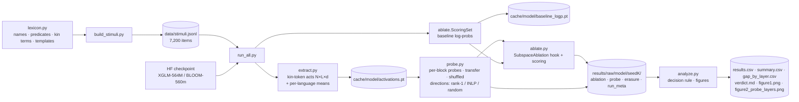

# PRD: latent-tongue-probe

Owner: Supratik Bhowal · Audience: Ryan Gomez, The Bu1LD (T-02 research screen) · Status: run complete, see §12 · Designed 13 Sep 2026 · Run 14 Sep 2026

---

## 1. Background

The Bu1LD thread T-02, "Sapir Whorf and the Latent Tongue", probes multilingual checkpoints to find which concepts collapse, which split, and which exist only inside one language. Ryan asked for a one-page experiment spec (`SPEC.md`) covering one T-02 probe. It needs a falsifiable hypothesis, an intervention, a model and dataset, a control, a primary metric, a falsifying result, and the smallest reproducible artifact that can ship in about a week.

The applicant's prior work, CoT-Mediate (arXiv:2607.27304), is **behavioral** mediation analysis: edit one attribute, hold everything else fixed, add a control that absorbs the obvious confound (provenance vs position). This project carries that method over to **model internals**: edit one direction in the residual stream, hold everything else fixed, and add controls that absorb the obvious confounds (random damage, generic language-channel effects, language identity).

## 2. Research question and hypothesis

**Question.** Is kinship *side* (paternal vs maternal) carried by a representation that exists only where a language lexicalizes it?

**Why this concept.** Bengali lexicalizes side: কাকা (father's brother) vs মামা (mother's brother). Hindi does too: चाचा vs मामा. English collapses both into "uncle". The referent is identical, and only the language forces the distinction. Almost no interpretability work covers Bengali, and the stimuli can be built and checked natively.

**Hypothesis H1 (primary).** In `facebook/xglm-564M` and `bigscience/bloom-560m`, at decoder block 12 of 24, take the rank-1 direction that separates কাকা from মামা. Mean-ablating it lowers Bengali side-question accuracy by at least **15 points more** than it lowers English side-question accuracy (where "uncle" gets its side only from context). A random rank-1 direction lowers Bengali accuracy by at most **3 points**.

**Null / alternative outcomes (all reportable):**
- *Shared subspace.* The Bengali direction hurts English equally, so side is encoded language-independently.
- *Decodable but unused.* The probe finds the direction, but ablating it does no more than random ablation. This is the read-out vs use gap, the same gap CoT-Mediate measured behaviorally.
- *Language-channel artifact.* The matched concept (gender) shows the same cross-language gap, so the measurement reflects generic bn-vs-en differences, not side.

## 3. Goals and non-goals

**Goals**
1. A clonable repo where one command reproduces every number and figure.
2. A pre-registered decision rule applied mechanically by code (`analyze.py`).
3. A hand-built, reviewable, NFC-normalized trilingual stimulus set with minimal-pair structure.
4. Runs inside one consumer GPU (RTX 3070, 8 GB) or Kaggle free tier, under 4 GPU-hours end to end.

**Non-goals**
- No generality claims beyond two models and one concept family.
- No large models, no fine-tuning, no SAEs, no attention-head circuit analysis.
- No use of unpublished CoT-Mediate data.
- No second concept family (colour, evidentiality, grammatical gender) this week.

## 4. Experimental design

### 4.1 Factors

| Factor | Levels | Role |
|---|---|---|
| Concept | `side` (primary), `gender` (matched control), `side_aunt` (backup, off by default) | what the label encodes |
| Language | `bn` (source), `hi` (identity control), `en` (target) | lexicalization varies |
| Context | `informative` (sentence 1 states the side), `neutral` ("Rahul has a big family.") | where the label information comes from |
| Label | 0 / 1 | minimal-pair contrast |
| Model | XGLM-564M, BLOOM-560M | replication across architectures and tokenizers |
| Seed | 0-4 | name-disjoint split + random control direction |

Lexicalization matrix (the core of the design):

| | bn | hi | en |
|---|---|---|---|
| side (uncle) | কাকা / মামা ✔ | चाचा / मामा ✔ | uncle / uncle ✘ |
| gender (paternal sibling) | কাকা / পিসি ✔ | चाचा / बुआ ✔ | uncle / aunt ✔ |
| side_aunt | পিসি / মাসি ✔ | बुआ / मौसी ✔ | aunt / aunt ✘ |

### 4.2 Stimulus format

Each item is three sentences:

```
<context sentence> <target sentence containing the kin term> <question>        → answer_0 | answer_1
Rahul's mother has one brother. Rahul's uncle lives in Kolkata. Question: Is Rahul's uncle the father's brother or the mother's brother? Answer:   → " father" | " mother"
রাহুলের মায়ের একজন ভাই আছেন। রাহুলের মামা কলকাতায় থাকেন। প্রশ্ন: রাহুলের মামা কি বাবার ভাই না মায়ের ভাই? উত্তর:   → " বাবার" | " মায়ের"
```

- 20 names × 10 predicates × 2 labels = **400 items (200 minimal pairs) per concept × context × language cell**. Across 3 concepts × 2 contexts × 3 languages that's 7,200 items; the default run uses 4,800 (side + gender).
- Predicates carry no kinship information. Bengali uses honorific verbs, which have no gender agreement. Hindi predicates agree with the kin term's gender (रहते/रहती), and the genitive particle agrees too (के/की).
- The question lists both options in a fixed order, identical across labels. Only the context and the kin term vary within a pair.
- All strings are NFC-normalized (য় and ज़ have composed and decomposed forms that tokenize differently).
- Every string lives in `src/lexicon.py`. `build_stimuli.py --preview` prints one pair per cell for native review.

### 4.3 Readouts

1. **Decodability (probe).** Logistic regression (C = 1, standardized features) on the residual stream at the output of each decoder block, at the **last token overlapping the kin term** in the target sentence. Train on 14 names, test on 6 held-out names. Every (train cell → test cell) pair is scored, which gives within-language accuracy and cross-language transfer. A shuffled-label probe gives the selectivity baseline.
2. **Behavior (question).** Item is correct iff `log p(answer_label | prompt) > log p(answer_other | prompt)`, where log p sums over answer tokens. Answer tokens come from tokenizing `prompt + answer` and stripping the prompt ids, falling back to tokenizing the answer alone if a BPE merge crosses the boundary.

### 4.4 Intervention

For a direction basis `V ∈ R^{d×k}` (orthonormal), applied as a forward hook on decoder block `L`:

```
h ← h − ((h − μ_lang) V) Vᵀ        at every position except position 0
```

- `μ_lang` is the label-free mean activation of the item's language at block L, over all non-initial tokens of all items. **Mean**-ablation removes the label information along V without pushing activations off-distribution along V. `mode: zero` is available.
- Position 0 is left untouched because it is the attention-sink token with outlier norms.
- Rank-1 `V` is the probe's weight vector mapped back to raw activation space (`w_std / σ`), normalized. Rank-k uses INLP: fit, project out, refit, then Gram-Schmidt.
- The hook is on the block output, so later blocks still attend to earlier positions. Removal across **all** positions (context tokens included) is what makes "shared concept direction" testable: if v is a shared side concept, removing it also strips side information from English "father's"/"mother's" tokens.

### 4.5 Controls

| Control | What it rules out | Implementation |
|---|---|---|
| Random direction, same rank | effect is generic damage | `random_basis(d, k, rng(seed, layer, k))`, same hook, same μ |
| Matched concept (`gender`) | effect is a generic bn-vs-en channel difference | identical pipeline with gender lexicalized in all 3 languages; its gap must stay ≥ 5 pts below the side gap |
| Language identity (`hi`) | the direction is just "Bengali-ness" | Hindi shares the distinction in a different script; its drop should sit closer to bn than to en |
| Neutral context | the English task is solvable without context | sanity check: en side accuracy ≈ chance under neutral context, bn/hi stay high |
| Shuffled-label probe | probe capacity / memorization | same features, permuted labels |
| Erasure check | ablation actually removed decodable information | refit probe on erased activations (`erasure.csv`) |

### 4.6 Primary metric and decision rule (pre-registered)

All computed at the **primary cell**: concept side, informative context, block `n_layers // 2` (= 12), rank 1, direction fitted on bn.

```
drop(lang, dir) = acc_clean(lang) − acc_ablated(lang; dir)
G               = drop(bn, v_bn) − drop(en, v_bn)          ← PRIMARY METRIC
specificity     = drop(bn, v_bn) − drop(bn, v_random)
G_matched       = same as G but for concept gender
```

Mean and std over 5 seeds. Decision order (`analyze.decide`):

1. **Gate.** If clean accuracy < 0.65 in bn or en, the verdict is INCONCLUSIVE: the model can't do the task, so drops are uninterpretable.
2. **Falsified** if any of:
   - F1: specificity < 3 pts. The direction is no more special than a random one.
   - F2: G < 5 pts. Side is encoded in a shared subspace.
   - F3: G_matched ≥ G − 5 pts. Language-channel artifact.
3. **Supported** if G ≥ 15 pts and drop(bn, v_random) ≤ 3 pts.
4. Otherwise **inconclusive** (between thresholds).

Reported alongside: the Hindi identity-control reading, rank-4 sensitivity, and the gap at every even block (`gap_by_layer.csv`). None of these can override the primary verdict.

**Why block 12 and not "best block".** Picking the block with the largest gap would be selection on the outcome. Mid-depth is fixed in advance, and the sweep is reported in full as secondary.

## 5. System architecture



### 5.1 Modules

| Module | Responsibility | Key functions |
|---|---|---|
| `lexicon.py` | all natural-language data | `NAMES`, `PREDICATES`, `KIN`, `ANSWERS`, `TEMPLATES` |
| `build_stimuli.py` | render items, char spans, pair ids | `render`, `build_all` |
| `models.py` | load model/tokenizer, find blocks, encoding helpers, offline tiny model | `load_model`, `get_blocks`, `get_base`, `special_prefix`, `encode` |
| `extract.py` | one pass per model, hooks on every block | `extract`, `kin_token_index` |
| `probe.py` | probes and subspaces | `Probe`, `inlp_basis`, `random_basis`, `erase` |
| `ablate.py` | continuation scoring, subspace hook | `ScoringSet`, `SubspaceAblation`, `score` |
| `run_all.py` | orchestration, caching, per-seed raw CSVs | `run_model`, `run_probes` |
| `analyze.py` | aggregation, verdict, figures | `metrics_for`, `decide`, `figure1`, `figure2` |

**Architecture-agnostic by construction.** Blocks are located by attribute path (`model.layers`, `transformer.h`, ...). Hooks handle tuple and tensor block outputs. Scoring runs the base model and applies the LM head **only at answer positions**, so no `[batch, seq, 250k]` logits tensor is ever materialized. That tensor would otherwise need >30 GB with these vocabularies.

### 5.2 Data schemas

`data/stimuli.jsonl`, one object per line:

| field | example |
|---|---|
| `id` | `side\|informative\|bn\|n00\|p00\|y1` |
| `pair_id` | `side\|informative\|bn\|n00\|p00` |
| `concept`, `context`, `lang`, `label`, `label_name` | `side`, `informative`, `bn`, `1`, `maternal` |
| `name_id`, `pred_id` | `0`, `0` |
| `text` | full prompt |
| `kin_term`, `kin_char_start`, `kin_char_end` | `মামা`, 37, 41 |
| `answers` | `[" বাবার", " মায়ের"]` |

`results/results.csv` (ablation, long format): `model, seed, concept, layer, rank, direction, context, eval_lang, acc, logit_diff, n`. `direction ∈ {none, bn, hi, en, random}`, and `layer = -1` for `none`.

`results/probe.csv`: `model, seed, concept, layer, train_context, train_lang, test_context, test_lang, control, acc`.

`results/erasure.csv`: `model, seed, concept, layer, rank, direction, lang, acc_before, acc_after`.

### 5.3 Caching and determinism

- Activations and un-ablated log-probs don't depend on the seed. They are cached per model and invalidated when the item id list changes.
- Seed k fixes the name split (`default_rng(k)`) and the random basis (`default_rng([k, layer, rank])`). Logistic regression (lbfgs) is deterministic.
- `run_meta.json` records device, GPU name, torch and python versions, and wall time per seed.

## 6. Compute plan

| Stage | Work per model | Notes |
|---|---|---|
| Extraction | 4,800 forwards, hooks on 24 blocks | once per model, cached (~470 MB float32) |
| Baseline scoring | 9,600 sequences | once per model, cached |
| Probes per seed | 576 fits + 576 shuffled + erasure refits, 1,024-dim, 280 train items | CPU, minutes |
| Ablation per seed | 12 blocks × 8 directions + 8 rank-4 = 104 conditions × 1,440 sequences ≈ 150k short sequences | the GPU-heavy part |

**Targets (estimates, to be replaced by `run_meta.json` numbers):** ~1.5 h total on the RTX 3070 and ~3 h on a Kaggle T4, for 2 models × 5 seeds. Memory: ~2.3 GB weights plus activations for batch 32 × ~120 tokens, well under 8 GB. If VRAM is tight, lower `--batch-size`. If time is tight, raise `layer_stride` (the primary cell doesn't depend on it).

**Execution venues**
1. **Remote RTX 3070 PC (primary).** `scripts/setup_remote.ps1` (Windows) or `scripts/setup_remote.sh` (Linux) creates a venv, installs torch 2.7.0 with CUDA 12.6 wheels, installs the pinned requirements, checks the GPU, and runs the tests. Move code over with git (preferred) or a zip. Copy `results/raw/` back.
2. **Kaggle (fallback).** GPU notebook with internet on, `pip install -r requirements.txt` without the torch line, `python src/run_all.py`.
3. **This laptop.** Editing, `pytest`, and `configs/smoke.yaml` only.

## 7. Reproducibility requirements

- One command: `python src/run_all.py` (all seeds) or `--seed 0` (one seed).
- Versions pinned in `requirements.txt` (tested: torch 2.7.0, transformers 4.57.3, scikit-learn 1.6.0).
- Stimuli committed and regenerable byte-for-byte from `lexicon.py`.
- Raw per-seed CSVs committed. `analyze.py` rebuilds every summary from them.
- Offline tests (`tests/`) cover stimulus invariants, kin-token location, scorer-vs-full-logits equality, the ablation invariant `((h−μ)V)=0` at positions ≥ 1 with position 0 untouched, and INLP orthonormality.
- `configs/smoke.yaml` runs the full pipeline offline on a tiny random model.

## 8. Timeline (one week)

| Day | Work | Exit criterion |
|---|---|---|
| 1 | Native review of `--preview` output (bn, hi). Fix lexicon. Rebuild stimuli. Tests pass. | reviewed lexicon committed |
| 2 | Remote 3070 setup, smoke config, `--seed 0` on XGLM | clean accuracy known; gate pass or fail |
| 3 | `--seed 0` on BLOOM; inspect figure2 and erasure sanity | pipeline trusted on real models |
| 4 | Seeds 1-4, both models | `results/raw` complete |
| 5 | `analyze.py`, verdict, figure1 | verdict.md |
| 6 | README runtime/outputs filled from `run_meta.json`; repo public | clone-and-run verified on a second machine or Kaggle |
| 7 | Buffer; email Ryan with repo link | sent |

## 9. Risks and mitigations

| Risk | Likelihood | Mitigation |
|---|---|---|
| ~560M models can't answer the question (clean acc < 0.65) | medium | pre-registered gate → INCONCLUSIVE, not a fake result. Fallback, announced *before* running: swap to `bigscience/bloom-1b7` or `facebook/xglm-1.7B` (float16 fits in 8 GB) |
| Bengali/Hindi tokenization fragments kin terms into many pieces | medium | probe uses the last overlapping token; answers are scored by summed log-prob over all tokens |
| Rank-1 erasure is too weak (information is redundant) | medium | erasure check makes it visible; rank-4 sensitivity is pre-registered |
| Probe direction picks up surface lexical identity (কাকা vs মামা tokens), not "side" | high by design | exactly what the en/hi transfer and the matched concept arbitrate; stated as a limitation |
| Translation errors in stimuli | low-medium | native review day 1; all text in one file |
| Answer-length bias (different token counts per answer) | low | balanced labels; clean accuracy reported per cell; logit-diff logged |
| Kaggle/driver version drift | low | pinned versions; `run_meta.json` records the environment |

## 10. Open decisions (resolved)

| Decision from conversation log | Resolution | Reason |
|---|---|---|
| XGLM + mT5, or another pair | **XGLM-564M + BLOOM-560m** | both decoder-only (one hook/scoring path), both pretrained on Bengali and Hindi, same size; mT5 is encoder-decoder and complicates the causal readout |
| Kinship only, or plus a backup | **kinship `side` + backup `side_aunt` built but off** | scope discipline; enable only if `side` is flat |
| Bengali dataset construction | **templated, hand-written lexicon** | 20 names × 10 predicates per cell; construction is documented and reviewable in a single file |
| Compute | **remote RTX 3070 first, Kaggle fallback** | no disconnects; 8 GB suffices |

## 11. Limitations to state up front

- Two small models, one concept family. Results say nothing about scale.
- Templated sentences are less natural than corpus text, which is the price of control.
- A linear direction is one hypothesis about representational form. A null result under linear ablation doesn't rule out nonlinear encoding.
- English side information is contextual by construction. The design measures whether the model *binds* it into a shared direction, not whether English speakers "think" in sides.

## 12. Amendments and outcome (14 Sep 2026)

**Amendments.** Each was decided from no-ablation diagnostics. Log: `results/pilot_seed0.md`. `configs/default.yaml` stays as the original pre-registration.

| | pre-registered | amended | trigger |
|---|---|---|---|
| readout | item accuracy | minimal-pair accuracy | `pick0` ≈ 0 or 1: constant answer bias |
| models | XGLM-564M, BLOOM-560m | BLOOM-560m, BLOOM-1b7 | XGLM fails the gate at 564M and 1.7B; §9 fallback |
| dtype | float32 | 560m float32, 1b7 bfloat16 | 1.7B must fit in 8 GB; bfloat16 broke 560m English (0.98 → 0.55) |
| thresholds, primary cell, controls, seeds | | unchanged | |

**Outcome** (5 seeds; full tables and caveats in `results/final_results.md`):

| concept | BLOOM-1b7 | BLOOM-560m |
|---|---|---|
| uncle side (primary) | **FALSIFIED**: G 1.5 ± 1.0, specificity 1.3 ± 1.6 | **FALSIFIED**: G 0.0 ± 1.1, specificity 1.7 ± 2.6 |
| aunt side (backup, §4.1) | **SUPPORTED**: G 16.8 ± 9.0, drop bn 21.2 ± 8.3 vs en 4.3 ± 4.0, random −0.8 | INCONCLUSIVE: en gate 0.63 |

**Lessons for the design.**
- The matched concept (gender) was at ceiling (gap 0.00 ± 0.00 everywhere), so F3 had no power. A future version needs a matched concept with clean accuracy below ceiling.
- The Hindi identity control failed the gate in BLOOM-1b7.
- The F3 rule (`gap_matched ≥ G − 5`) fires vacuously when G ≈ 0. It should only be evaluated when G ≥ `falsify_gap`.
- Answer-bias and precision checks (`diagnose_baseline.py`) belong *before* the pre-registration is frozen, not after the pilot.
