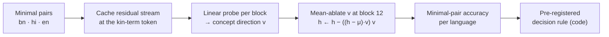

# Latent Tongue Probe

**Do multilingual language models keep a concept in a language-specific direction when only some languages name it?**

Bengali has separate words for a father's brother (কাকা) and a mother's brother (মামা). Hindi does too (चाचा / मामा). English has one word, *uncle*. This repo tests whether a model's internal "which side of the family" direction belongs to the languages that name the distinction, or is shared with English. It works by removing that direction from the model and measuring what breaks, in which language.

> 📄 **One-page experiment spec: [SPEC.md](SPEC.md)**. Hypothesis, intervention, controls, metric, and falsifiers, fixed before the run.
> 📊 **Results and caveats: [results/final_results.md](results/final_results.md)** · 🧪 **Pilot, diagnostics and amendments: [results/lab_log.md](results/lab_log.md)**

Built as a probe for The Bu1LD thread **T-02, "Sapir Whorf and the Latent Tongue."**

---

## Result at a glance

5 seeds, one RTX 3070. The primary cell is decoder block 12 of 24, a rank-1 direction fitted on Bengali, and minimal-pair accuracy. **G** = Bengali accuracy drop − English accuracy drop, in points. The pre-registered bar for support is G ≥ 15 with a random-direction drop ≤ 3.

| concept | BLOOM-1b7 | BLOOM-560m |
|---|---|---|
| **Uncle side** (কাকা / মামা): primary hypothesis | **Falsified**. G = 1.5 ± 1.0 | **Falsified**. G = 0.0 ± 1.1 |
| **Aunt side** (পিসি / মাসি): pre-specified backup | **Supported**. G = 16.8 ± 9.0 (accuracy change: bn −21.2, en −4.3, random direction +0.8) | Inconclusive (fails English task gate) |

**Reading.** Kinship side is perfectly decodable at the kin word, but for *uncle* the model doesn't use that direction. Removing it moves answers about 1 point in every language, no more than a random direction does. For *aunt*, BLOOM-1b7 shows the predicted Bengali-specific dependence. That result comes from one model and the backup concept, with high seed variance and a matched control at ceiling, so it is **a lead, not a finding**. All caveats are listed in [results/final_results.md](results/final_results.md).

---

## Design

### The contrast

| | Bengali | Hindi | English |
|---|---|---|---|
| **uncle side** (hypothesis) | কাকা / মামা ✔ | चाचा / मामा ✔ | uncle / uncle ✘ |
| **gender** (matched control) | কাকা / পিসি ✔ | चाचा / बुआ ✔ | uncle / aunt ✔ |
| **aunt side** (backup) | পিসি / মাসি ✔ | बुआ / मौसी ✔ | aunt / aunt ✘ |

✔ = the language has separate words for the two cases.

### Method



1. **Stimuli.** *Context sentence · sentence with the kin term · question*. There are 200 minimal pairs per concept × language × context cell, split by name into train and test (14 / 6 names).
2. **Direction.** A logistic probe on the block-12 residual stream at the kin-term token. Its weights, mapped back to activation space, give **v**.
3. **Intervention.** Remove the component along **v** at every token after the first, relative to the language's label-free mean activation.
4. **Readout.** *Minimal-pair accuracy*: the maternal item must prefer "mother's" more than its paternal partner does. This cancels the models' strong constant answer bias.
5. **Decision.** `analyze.decide` applies the thresholds from the config, so the verdict can't be tuned by hand.

### Controls

| control | rules out |
|---|---|
| Random direction of equal rank | generic damage from ablation |
| Matched concept (gender, named in every language) | a generic Bengali-vs-English channel effect |
| Hindi (names the distinction, different script) | the direction is just "Bengali-ness" |
| Neutral context · shuffled-label probe | English solvable without context · probe memorization |

### Amendments

Three changes were made **from no-ablation diagnostics, before ablation results were read**. Thresholds, primary cell, controls and seeds are unchanged. [`configs/default.yaml`](configs/default.yaml) is the untouched original.

| | original | reported ([`configs/amended.yaml`](configs/amended.yaml)) | why |
|---|---|---|---|
| readout | item accuracy | minimal-pair accuracy | models answered almost the same regardless of input |
| models | XGLM-564M, BLOOM-560m | BLOOM-560m, BLOOM-1b7 | XGLM failed the task gate at 564M and 1.7B |
| precision | float32 | 560m float32, 1b7 bfloat16 | 1.7B needs bfloat16 for 8 GB; bfloat16 broke 560m's English |

---

## Reproduce

### Quick start (GPU)

```bash
python -m venv .venv && source .venv/bin/activate          # Windows: .\.venv\Scripts\Activate.ps1
pip install torch==2.7.0 --index-url https://download.pytorch.org/whl/cu126
pip install -r requirements.txt
python -m pytest tests -q
python src/run_all.py --config configs/amended.yaml        # reported run  → results_amended/  (~96 min)
python src/run_all.py --config configs/backup.yaml         # backup concept → results_backup/  (~98 min)
```

`scripts/setup_remote.ps1` and `scripts/setup_remote.sh` do the setup in one step. On Windows, `scripts/overnight.ps1` runs both configs unattended and keeps the machine awake.

> **Windows note:** always run from the activated `.venv`. A system-wide Python with a different `sentencepiece` build can crash on import.

### Without a GPU

```bash
pip install -r requirements.txt
python -m pytest tests -q                                  # ablation invariant, scorer = full logits, stimulus checks
python src/run_all.py --config configs/smoke.yaml          # full pipeline on a tiny random model, a few minutes
```

The smoke run downloads nothing and its numbers mean nothing. It only exercises the plumbing.

### Inspection tools

```bash
python src/build_stimuli.py --preview                      # one minimal pair per cell, for native-speaker review
python src/diagnose_baseline.py                            # answer bias and pair accuracy from cached scores
python src/per_seed.py --config configs/backup.yaml        # per-seed primary cell and matched-control ceiling
python src/analyze.py --config configs/amended.yaml        # rebuild tables, verdict and figures from raw CSVs
```

### Runtime (measured, RTX 3070 8 GB)

| config | models | per seed | 5 seeds |
|---|---|---|---|
| `amended.yaml` | BLOOM-560m (fp32) + BLOOM-1b7 (bf16) | ~8 + ~10.5 min | 96 min |
| `backup.yaml` | same | same | 98 min |

Out of memory: add `--batch-size 8`. Short on time: raise `ablation.layer_stride`. The primary block is always included.

---

## Repository layout

```
SPEC.md                    one-page experiment spec
configs/
  default.yaml             original pre-registration (thresholds live here)
  amended.yaml             reported design (amendments above)
  backup.yaml              pre-specified backup concept (aunt side)
  smoke.yaml               offline pipeline check
data/stimuli.jsonl         7,200 items, generated from src/lexicon.py
src/
  lexicon.py               every natural-language string, in one reviewable file
  build_stimuli.py         renders items, character spans, minimal-pair ids
  models.py                loading, block lookup, tokenization helpers
  extract.py               kin-token activations + per-language means
  probe.py                 probes, INLP subspaces, random subspaces, erasure
  ablate.py                subspace mean-ablation hook + continuation scoring
  run_all.py               entry point
  analyze.py               decision rule, tables, figures
  diagnose_baseline.py     answer-bias diagnostics
  per_seed.py              per-seed breakdown
tests/                     offline tests
scripts/                   GPU setup and unattended runner
results/
  final_results.md         outcome, tables, caveats
  lab_log.md               pilot, diagnostics, amendments (chronological)
results_amended/           reported run
results_backup/            backup-concept run
```

Each run directory has this layout:

| file | content |
|---|---|
| `verdict.md` | SUPPORTED / FALSIFIED / INCONCLUSIVE per model, with the reasons |
| `figure1.png` | accuracy drop per language under the concept, random and matched-control directions |
| `figure2_probe_layers.png` | probe accuracy by block, language and context, with a shuffled-label control |
| `results.csv` | every ablation condition × seed × language × context (`acc`, `pair_acc`, `logit_diff`) |
| `summary.csv`, `gap_by_layer.csv`, `probe.csv`, `erasure.csv` | aggregates and secondary analyses |
| `raw/<model>/seed<k>/` | per-seed CSVs + `run_meta.json` (GPU, dtype, versions, wall time) |

---

## Sanity checks

These show the pipeline is working. They are not the result.

| check | where | expected |
|---|---|---|
| shuffled-label probe | `probe.csv`, `control == shuffled` | ≈ 0.5 at every block |
| English side question, neutral context | `results.csv`, `direction == none` | `pair_acc` = 0.50 exactly (identical prompts) |
| random-direction drop | `figure1.png`, middle bars | ≈ 0 points |
| task gate | `verdict.md` | clean accuracy ≥ 0.65 in Bengali and English, otherwise INCONCLUSIVE by design |

## Limitations

- Two models from one family (BLOOM). XGLM was excluded at the task gate, so there is no cross-architecture replication.
- Templated sentences trade naturalness for control.
- A linear, single-block intervention. A null result doesn't rule out distributed or nonlinear use.
- The matched gender control sat at ceiling, so it couldn't detect a language-channel artifact.
- BLOOM-1b7 ran in bfloat16 to fit 8 GB.

## Author

Supratik Bhowal. The method carries the one-edit, one-control logic of *Position, Not Provenance: Separating Reasoning Mediation from Sycophancy in Medical Vision-Language Models* ([arXiv:2607.27304](https://arxiv.org/abs/2607.27304)) from prompts over to model internals.
